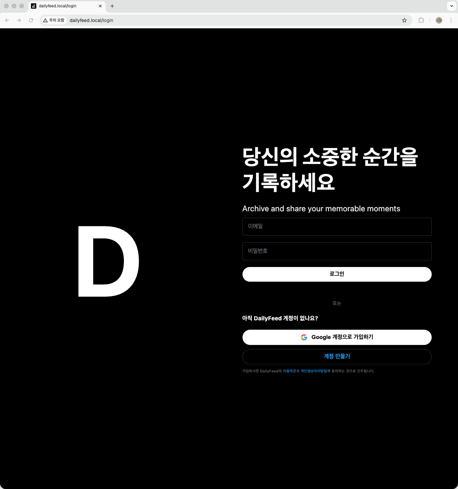

# dailyfeed frontend




# orbstack

Docker Desktop 을 사용할수도 있고, 무료로 사용할 수 있는 orbstack 도 사용가능합니다.

<br/>


# local k8s 환경

kind 를 사용합니다.

<br/>


# 빌드 (local-k8s)

## latest 이미지 빌드

```bash
docker build -t dailyfeed-frontend:latest .
docker tag dailyfeed-frontend:latest alpha300uk/dailyfeed-frontend:latest
docker push alpha300uk/dailyfeed-frontend:latest
```

<br/>


## 특정 버전 빌드

```bash
docker build -t dailyfeed-frontend:latest .
docker tag dailyfeed-frontend:latest alpha300uk/dailyfeed-frontend:latest
docker push alpha300uk/dailyfeed-frontend:latest
```

<br/>


## k8s deploy,ingress 배포

```bash
kubectl apply -f k8s/configmap-local-k8s.yaml
kubectl apply -f k8s/deployment.yaml
kubectl apply -f k8s/ingress.yaml
```

<br/>


# 네트워크 설정

/etc/hosts 에 개발 도메인을 추가하기 위해 다음의 명령을 수행해주세요.

```bash
sudo sh -c 'echo "127.0.0.1    dailyfeed.local" >> /etc/hosts'
```

<br/>


# 참고


## 리소스 관리

현재 설정:

- CPU Request: 250m (0.25 코어)
- CPU Limit: 500m (0.5 코어)
- Memory Request: 256Mi
- Memory Limit: 512Mi

필요에 따라 `deployment.yaml`의 `resources` 섹션을 조정하세요.

<br/>


## 보안 고려사항

1. **환경변수 보안**: 민감한 정보는 ConfigMap 대신 Secret 사용
2. **이미지 보안**: 정기적인 보안 스캔 및 업데이트
3. **네트워크 정책**: 필요한 트래픽만 허용하도록 NetworkPolicy 설정
4. **RBAC**: 최소 권한 원칙에 따라 ServiceAccount 구성


## 추가 정보

프로젝트 구조:

- `/k8s/` - Kubernetes 매니페스트 파일
- `/src/config/env.ts` - 환경 설정 중앙화
- `/src/lib/auth.ts` - 백엔드 API 호출 로직
- `/.env` - 로컬 개발 환경변수
