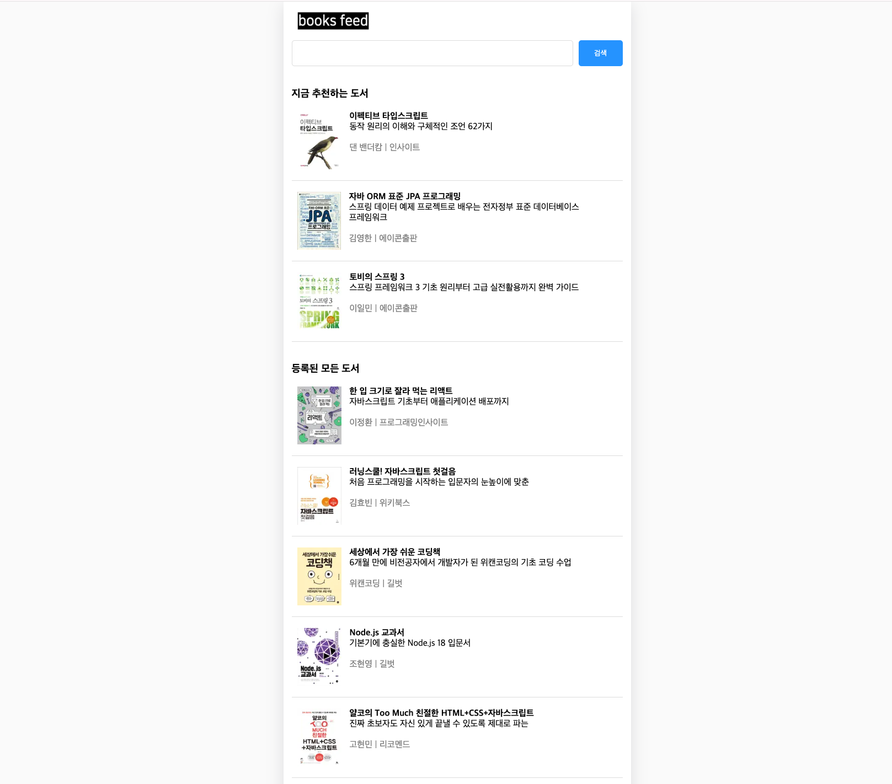

# Project



# .env
다음과 같이 `NEXT_PUBLIC_API_SERVER` 라는 환경변수에 백엔드 API 의 주소를 입력해주셔아 합니다.
```plain
NEXT_PUBLIC_API_SERVER_URL=http://localhost:8888
```
<br/>

`.env` 파일은 별도로 제공되지 않으며 `.env` 파일을 만든 후 별도로 위와 같이 적어주시면 됩니다.

# 로컬 실행
```bash
### 의존성 설치
npm i

### 로컬 구동
npm run dev
```
<br/>

# 단순 빌드
```bash
### 빌드
npm run build

### 운영 start
npm run start
```
<br/>


# Docker


# eks 배포

